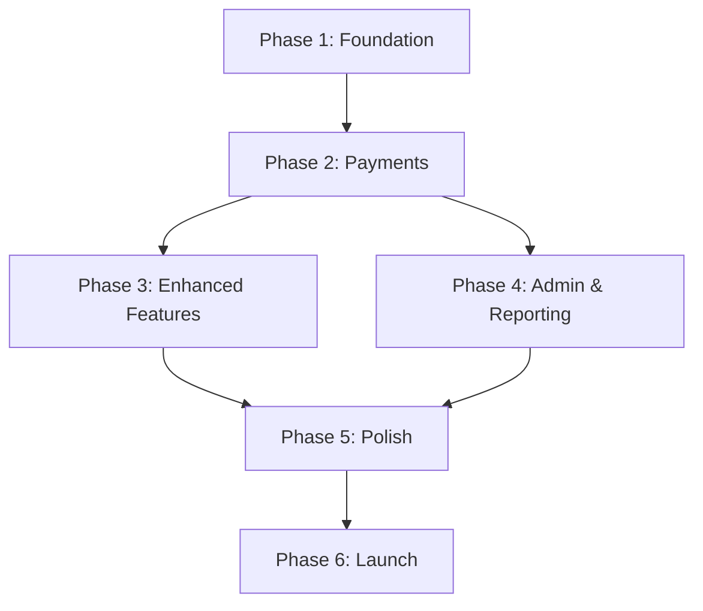

# Learning Through Motion - Implementation Roadmap

## Overview

This roadmap breaks down the booking system into manageable phases, allowing for incremental development, testing, and launch. Each phase delivers working functionality while building toward the complete system.

**Total Estimated Timeline:** 12-16 weeks
**Recommended Team:** 1-2 developers + 1 designer (part-time)

---

## Phase 1: Foundation & MVP (Weeks 1-4)

### Goal
Launch a minimal viable product that allows parents to view session blocks and make bookings via a simple form, with manual admin processing.

### Core Features

#### 1.1 Infrastructure Setup (Week 1)
**Deliverables:**
- [ ] Database setup (Supabase/Vercel Postgres)
- [ ] Authentication system (NextAuth.js)
- [ ] Project structure and routing
- [ ] Environment configuration
- [ ] Basic admin authentication

**Technical Tasks:**
```bash
# Install dependencies
npm install @supabase/supabase-js
npm install next-auth
npm install stripe
npm install @stripe/stripe-js
npm install resend
npm install zod
npm install date-fns
```

**Database Tables (Initial):**
- `users` - Parent accounts
- `children` - Child profiles
- `session_blocks` - 7-week blocks
- `bookings` - Booking records
- `payments` - Payment tracking

**Files to Create:**
```
/lib
  /db
    schema.sql           # Database schema
    client.ts            # Database client
  /auth
    config.ts            # NextAuth config
/app
  /api
    /auth/[...nextauth]  # Auth routes
```

#### 1.2 Session Block Display (Week 2)
**Deliverables:**
- [ ] Public page showing available session blocks
- [ ] Block details page with calendar view
- [ ] Capacity indicators
- [ ] Responsive design

**Pages:**
```
/shop
/shop/sessions
/shop/blocks
/shop/blocks/[id]
```

**Components:**
```typescript
<SessionBlockCard />        // Display block summary
<BlockCalendar />          // 7-week calendar view
<CapacityIndicator />      // Shows spots remaining
<PricingDisplay />         // Breakdown of costs
```

#### 1.3 Simple Booking Form (Week 2-3)
**Deliverables:**
- [ ] Account registration
- [ ] Child profile creation
- [ ] Basic booking form
- [ ] Form validation
- [ ] Email confirmation (manual approval)

**Flow:**
```
1. Parent creates account
2. Adds child profile
3. Selects session block
4. Fills booking form
5. Submits (goes to "Pending" status)
6. Admin receives email notification
7. Admin manually processes
```

**Components:**
```typescript
<SignUpForm />
<ChildProfileForm />
<BookingForm />
<BookingSummary />
```

#### 1.4 Basic Admin Panel (Week 3-4)
**Deliverables:**
- [ ] Admin login
- [ ] View pending bookings
- [ ] Approve/reject bookings
- [ ] Mark payments as received
- [ ] Send confirmation emails

**Pages:**
```
/admin
/admin/dashboard
/admin/bookings
/admin/bookings/[id]
```

**Admin Features:**
- List pending bookings
- View booking details
- Change booking status
- Record payment received
- Send email notifications

### Success Criteria
✅ Parents can browse session blocks
✅ Parents can create accounts and book sessions
✅ Admins can view and manage bookings
✅ Email notifications sent for new bookings
✅ System handles first 10 bookings manually

### What's NOT in Phase 1
❌ Online payments
❌ Discount codes
❌ Free trials
❌ Parent dashboard
❌ Attendance tracking
❌ Automated emails

---

## Phase 2: Payment Integration (Weeks 5-7)

### Goal
Add Stripe payment processing to enable parents to pay online, reducing manual admin work.

### Core Features

#### 2.1 Stripe Integration (Week 5)
**Deliverables:**
- [ ] Stripe account setup
- [ ] Payment Intent creation
- [ ] Checkout page with Stripe Elements
- [ ] Payment confirmation flow
- [ ] Webhook handling

**API Endpoints:**
```typescript
POST /api/payments/create-intent
POST /api/payments/confirm
POST /api/webhooks/stripe
```

**Pages:**
```
/booking/checkout
/booking/confirmation/[id]
```

**Components:**
```typescript
<StripeCheckoutForm />
<PaymentMethodSelector />  // Online vs Bank Transfer
<PaymentSummary />
<PaymentConfirmation />
```

#### 2.2 Bank Transfer Option (Week 5)
**Deliverables:**
- [ ] Bank transfer instructions display
- [ ] Unique payment reference generation
- [ ] Payment tracking system
- [ ] Payment reminder emails

**Flow:**
```
1. Parent selects "Bank Transfer"
2. System generates unique reference
3. Shows bank details
4. Booking marked as "Pending Payment"
5. Admin marks payment as received
6. Status changes to "Confirmed"
```

#### 2.3 Payment Dashboard (Week 6)
**Deliverables:**
- [ ] Admin payment management page
- [ ] Filter by payment status
- [ ] Mark payments as received
- [ ] Send payment reminders
- [ ] Payment history view

**Admin Pages:**
```
/admin/payments
/admin/payments/pending
/admin/payments/[id]
```

**Features:**
- List all payments
- Filter: Paid, Pending, Overdue
- Mark bank transfers as received
- Send reminder emails
- Export to CSV

#### 2.4 Parent Payment History (Week 6-7)
**Deliverables:**
- [ ] Parent account dashboard
- [ ] Payment history view
- [ ] Download receipts
- [ ] View outstanding payments

**Pages:**
```
/account/dashboard
/account/payments
/account/receipts/[id]
```

### Testing Phase 2
- [ ] Test Stripe payment flow end-to-end
- [ ] Test payment failure scenarios
- [ ] Test bank transfer flow
- [ ] Test payment webhook handling
- [ ] Verify payment notifications
- [ ] Test refund process

### Success Criteria
✅ Parents can pay online with credit/debit card
✅ Bank transfer option available with instructions
✅ Payment confirmation emails sent automatically
✅ Admin can track all payments
✅ Receipts generated and downloadable
✅ 95%+ payment success rate

---

## Phase 3: Enhanced Features (Weeks 8-10)

### Goal
Add discount codes, free trials, and improved user experience features.

### Core Features

#### 3.1 Discount Code System (Week 8)
**Deliverables:**
- [ ] Discount code database table
- [ ] Admin discount code management
- [ ] Discount validation API
- [ ] Apply discount in checkout
- [ ] Usage tracking

**Database Table:**
```sql
CREATE TABLE discount_codes (
  id UUID PRIMARY KEY,
  code VARCHAR(50) UNIQUE,
  type ENUM('percentage', 'fixed_amount'),
  value DECIMAL,
  valid_from DATE,
  valid_until DATE,
  usage_limit INTEGER,
  times_used INTEGER DEFAULT 0,
  status VARCHAR(20)
);
```

**Admin Pages:**
```
/admin/discount-codes
/admin/discount-codes/create
/admin/discount-codes/[id]
```

**Features:**
- Create discount codes
- Set expiry dates
- Set usage limits
- Track usage
- Enable/disable codes

**Parent Flow:**
```
1. Enter discount code at checkout
2. System validates code
3. Discount applied to total
4. Discount saved with booking
5. Code usage incremented
```

#### 3.2 Free Trial System (Week 8-9)
**Deliverables:**
- [ ] Trial booking page
- [ ] Trial session calendar
- [ ] Trial-to-paid conversion flow
- [ ] Post-trial discount code automation
- [ ] Trial analytics

**Pages:**
```
/trial
/trial/book
/trial/confirmation/[id]
```

**Flow:**
```
1. Parent clicks "Try Free Session"
2. Creates account (if new)
3. Adds child profile
4. Selects available trial date
5. Confirms trial booking
6. Receives confirmation email
7. [After trial] Receives follow-up with discount code
8. Books full block with discount
```

**Components:**
```typescript
<TrialCTA />
<TrialCalendar />
<TrialBookingForm />
<PostTrialOffer />
```

#### 3.3 Improved Parent Dashboard (Week 9-10)
**Deliverables:**
- [ ] Enhanced dashboard with widgets
- [ ] Upcoming sessions list
- [ ] Quick actions menu
- [ ] Booking history timeline
- [ ] Children management

**Dashboard Widgets:**
```typescript
<NextSessionWidget />       // Next upcoming session
<BookingStatusWidget />     // Active bookings
<ChildrenWidget />          // Manage children
<QuickActionsWidget />      // Common actions
<BookingHistoryWidget />    // Past bookings
```

**Features:**
- View upcoming sessions
- Download calendar invites (.ics)
- Manage child profiles
- Quick re-booking
- Payment reminders

#### 3.4 Email Automation System (Week 10)
**Deliverables:**
- [ ] Email template system
- [ ] Scheduled email jobs
- [ ] Email tracking
- [ ] Customizable templates

**Email Types:**
```typescript
const emailTemplates = {
  'booking-confirmation': {},
  'payment-received': {},
  'session-reminder-24h': {},
  'block-ending-soon': {},
  'post-trial-followup': {},
  'payment-reminder': {},
};
```

**Automation:**
- Booking confirmation (immediate)
- Payment received (immediate)
- Session reminder (24h before)
- Post-trial follow-up (24h after trial)
- Block ending reminder (1 week before end)
- Payment reminder (3 days overdue)

### Testing Phase 3
- [ ] Test discount code validation
- [ ] Test discount application in checkout
- [ ] Test free trial booking flow
- [ ] Test trial-to-paid conversion
- [ ] Test email automation triggers
- [ ] Test dashboard functionality

### Success Criteria
✅ Discount codes working and trackable
✅ Free trial bookings processing smoothly
✅ 60%+ trial conversion rate
✅ Automated emails sending on schedule
✅ Parent dashboard provides clear overview
✅ Re-booking rate increases by 30%+

---

## Phase 4: Advanced Admin & Reporting (Weeks 11-12)

### Goal
Provide comprehensive admin tools for session management, reporting, and business insights.

### Core Features

#### 4.1 Session Block Management (Week 11)
**Deliverables:**
- [ ] Create new session blocks
- [ ] Edit existing blocks
- [ ] Duplicate blocks for next term
- [ ] Publish/unpublish blocks
- [ ] Session capacity management

**Admin Pages:**
```
/admin/sessions
/admin/sessions/create
/admin/sessions/[id]/edit
/admin/sessions/[id]/attendees
```

**Features:**
- Visual block builder
- Date picker for 7-week range
- Set capacity and pricing
- Preview before publishing
- Clone previous block

**Components:**
```typescript
<BlockBuilder />
<DateRangePicker />
<SessionScheduler />
<CapacityManager />
```

#### 4.2 Attendance Tracking (Week 11)
**Deliverables:**
- [ ] Mark attendance for each session
- [ ] Attendance history per child
- [ ] Attendance reports
- [ ] Notification for frequent absences

**Database Table:**
```sql
CREATE TABLE attendance (
  id UUID PRIMARY KEY,
  session_id UUID REFERENCES sessions(id),
  child_id UUID REFERENCES children(id),
  status VARCHAR(20), -- present, absent, late
  notes TEXT,
  marked_at TIMESTAMP,
  marked_by UUID REFERENCES users(id)
);
```

**Admin Features:**
- Session attendance sheet
- Quick mark all as present
- Individual status per child
- Absence patterns detection

#### 4.3 Reporting & Analytics (Week 12)
**Deliverables:**
- [ ] Revenue dashboard
- [ ] Booking statistics
- [ ] Attendance reports
- [ ] Discount code effectiveness
- [ ] Export functionality

**Reports:**
```typescript
type ReportType =
  | 'revenue-summary'      // Total revenue by period
  | 'bookings-by-source'   // Where bookings came from
  | 'capacity-utilization' // Fill rate per block
  | 'discount-usage'       // Which codes used most
  | 'attendance-summary'   // Attendance patterns
  | 'payment-collection';  // Payment status overview
```

**Admin Pages:**
```
/admin/reports
/admin/reports/revenue
/admin/reports/attendance
/admin/reports/bookings
```

**Visualizations:**
- Revenue chart (line graph)
- Booking funnel (conversion rates)
- Capacity gauge (per block)
- Payment status pie chart

#### 4.4 Communication Tools (Week 12)
**Deliverables:**
- [ ] Send announcements to all parents
- [ ] Email specific booking groups
- [ ] SMS notifications (optional)
- [ ] Message templates

**Features:**
- Compose message to all parents
- Filter recipients by block/status
- Schedule messages for later
- Message history log

### Testing Phase 4
- [ ] Test session creation workflow
- [ ] Test attendance marking
- [ ] Verify report accuracy
- [ ] Test data export functionality
- [ ] Test bulk messaging

### Success Criteria
✅ Admin can create and manage blocks independently
✅ Attendance tracked for all sessions
✅ Reports provide actionable insights
✅ 90%+ admin task completion time reduction
✅ Accurate financial reporting for accounting

---

## Phase 5: Polish & Optimization (Weeks 13-14)

### Goal
Refine user experience, optimize performance, and prepare for scale.

### Core Features

#### 5.1 UX Enhancements (Week 13)
**Deliverables:**
- [ ] Loading states and skeletons
- [ ] Error boundaries and fallbacks
- [ ] Improved mobile experience
- [ ] Accessibility audit and fixes
- [ ] Onboarding tutorial

**Improvements:**
- Smooth transitions between steps
- Clear progress indicators
- Helpful tooltips and guidance
- Better form validation feedback
- Empty state illustrations

**Components:**
```typescript
<LoadingSkeleton />
<ErrorBoundary />
<TooltipHelper />
<ProgressStepper />
<OnboardingModal />
```

#### 5.2 Performance Optimization (Week 13)
**Deliverables:**
- [ ] Code splitting optimization
- [ ] Image optimization
- [ ] Database query optimization
- [ ] Caching strategy
- [ ] Bundle size reduction

**Optimizations:**
- Lazy load heavy components
- Optimize images with next/image
- Add database indexes
- Implement Redis caching
- Reduce JavaScript bundle

**Metrics to Improve:**
- First Contentful Paint < 1.5s
- Time to Interactive < 3s
- Lighthouse score > 90
- Bundle size < 200kb

#### 5.3 Security Hardening (Week 14)
**Deliverables:**
- [ ] Security audit
- [ ] Rate limiting
- [ ] Input sanitization
- [ ] CSRF protection
- [ ] SQL injection prevention

**Security Measures:**
- Rate limit API endpoints
- Sanitize all user inputs
- Implement CSRF tokens
- Use parameterized queries
- Add security headers

#### 5.4 Documentation (Week 14)
**Deliverables:**
- [ ] User guide for parents
- [ ] Admin manual
- [ ] API documentation
- [ ] Deployment guide
- [ ] Troubleshooting guide

**Documentation:**
```
/docs
  /user-guide
    getting-started.md
    booking-sessions.md
    managing-account.md
    faqs.md
  /admin-guide
    session-management.md
    handling-payments.md
    generating-reports.md
    support-workflows.md
  /technical
    api-reference.md
    database-schema.md
    deployment.md
    troubleshooting.md
```

### Testing Phase 5
- [ ] Full regression testing
- [ ] Cross-browser testing
- [ ] Mobile device testing
- [ ] Load testing
- [ ] Security penetration testing

### Success Criteria
✅ Page load times under 2 seconds
✅ Zero critical security vulnerabilities
✅ Lighthouse scores 90+ across all pages
✅ Comprehensive documentation complete
✅ Ready for public launch

---

## Phase 6: Launch & Growth (Weeks 15-16)

### Goal
Soft launch to initial users, gather feedback, and prepare for full public launch.

### Core Features

#### 6.1 Soft Launch (Week 15)
**Deliverables:**
- [ ] Deploy to production
- [ ] Configure monitoring
- [ ] Set up error tracking
- [ ] Enable analytics
- [ ] Prepare support channels

**Pre-Launch Checklist:**
- [ ] All tests passing
- [ ] Database backed up
- [ ] Environment variables configured
- [ ] Stripe in live mode
- [ ] Email sending configured
- [ ] Domain and SSL configured
- [ ] Analytics installed
- [ ] Error monitoring active
- [ ] Support email setup

**Soft Launch Strategy:**
```
Week 15:
- Day 1-2: Internal testing with team
- Day 3-4: Invite previous trial attendees (10-15 families)
- Day 5-7: Monitor closely, fix bugs, gather feedback
```

#### 6.2 Feedback & Iteration (Week 15)
**Deliverables:**
- [ ] User feedback survey
- [ ] Analytics review
- [ ] Bug fixes
- [ ] UX improvements
- [ ] Documentation updates

**Feedback Collection:**
- Post-booking survey
- Email feedback requests
- Analytics funnel analysis
- Support ticket themes
- Direct user interviews (3-5 parents)

**Key Metrics to Monitor:**
```typescript
const launchMetrics = {
  // Conversion
  'trial-signup-rate': 0,
  'trial-conversion-rate': 0,
  'booking-completion-rate': 0,
  'payment-success-rate': 0,

  // Performance
  'avg-page-load-time': 0,
  'error-rate': 0,
  'uptime-percentage': 0,

  // Business
  'total-bookings': 0,
  'total-revenue': 0,
  'avg-booking-value': 0,
  'customer-satisfaction': 0,
};
```

#### 6.3 Public Launch (Week 16)
**Deliverables:**
- [ ] Full public launch
- [ ] Marketing announcement
- [ ] Press release
- [ ] Social media campaign
- [ ] Email to full waitlist

**Launch Day Plan:**
```
Morning:
- Final system check
- Verify all integrations
- Test critical paths

Launch:
- Make site public
- Send announcement emails
- Post on social media
- Update Google Business listing

Afternoon:
- Monitor bookings in real-time
- Respond to support inquiries
- Track conversion metrics

Evening:
- Review day's performance
- Address any issues
- Plan next day's focus
```

#### 6.4 Post-Launch Support (Week 16+)
**Deliverables:**
- [ ] Dedicated support channel
- [ ] Daily metrics review
- [ ] Regular system health checks
- [ ] User feedback sessions
- [ ] Continuous improvements

**Ongoing Activities:**
- Monitor support tickets
- Review analytics weekly
- Monthly feature planning
- Quarterly system audits
- Annual security review

### Success Criteria
✅ Successful soft launch with no critical issues
✅ Positive feedback from initial users
✅ Payment processing working smoothly
✅ Support inquiries resolved within 24h
✅ Public launch executed successfully
✅ Clear roadmap for ongoing improvements

---

## Resource Requirements

### Development Team

**Minimum Viable Team:**
- 1 Full-stack Developer (lead)
- 1 Designer (part-time, weeks 1-4, 13-14)

**Optimal Team:**
- 1 Frontend Developer
- 1 Backend Developer
- 1 Designer (part-time)
- 1 QA Tester (part-time, phases 2-5)

### Time Commitment

**Phase 1-2 (Weeks 1-7):**
- Developer: 35-40 hours/week
- Designer: 10-15 hours/week

**Phase 3-4 (Weeks 8-12):**
- Developer: 30-35 hours/week
- Designer: 5-10 hours/week

**Phase 5-6 (Weeks 13-16):**
- Developer: 25-30 hours/week
- QA: 10-15 hours/week

### Budget Considerations

**Development Costs:**
- Developer @ £50-80/hour × 500 hours = £25,000-40,000
- Designer @ £40-60/hour × 80 hours = £3,200-4,800
- QA @ £30-50/hour × 60 hours = £1,800-3,000
**Total Development:** £30,000-47,800

**Infrastructure Costs (Annual):**
- Vercel (Hobby/Pro): £0-240/year
- Database (Supabase/Postgres): £0-300/year
- Stripe fees: 1.4% + 20p per transaction
- Email (Resend): £0-240/year
- Monitoring (Sentry): £0-240/year
**Total Infrastructure:** £0-1,020/year + transaction fees

**Total Investment:** £30,000-50,000 one-time + ongoing costs

---

## Risk Management

### Technical Risks

| Risk | Impact | Probability | Mitigation |
|------|--------|-------------|------------|
| Payment integration issues | High | Medium | Thorough testing, Stripe test mode |
| Database performance | Medium | Low | Proper indexing, query optimization |
| Email deliverability | Medium | Medium | Use reputable provider, SPF/DKIM |
| Security vulnerabilities | High | Low | Regular audits, follow best practices |
| Scale issues | Medium | Low | Monitor performance, plan scaling |

### Business Risks

| Risk | Impact | Probability | Mitigation |
|------|--------|-------------|------------|
| Low adoption | High | Medium | Free trials, marketing, referrals |
| Payment collection | Medium | Medium | Clear terms, reminders, Stripe |
| No-shows/cancellations | Medium | Medium | Cancellation policy, reminders |
| Competition | Low | Low | Unique value proposition, quality |
| Regulatory changes | Low | Low | Stay informed, legal review |

---

## Success Metrics by Phase

### Phase 1 Success Metrics
- System handles 20+ bookings
- Zero data loss incidents
- Admin can process bookings in <5 minutes
- Email notifications 99%+ delivered

### Phase 2 Success Metrics
- 95%+ payment success rate
- Average checkout time <3 minutes
- Zero payment data breaches
- Bank transfer tracking 100% accurate

### Phase 3 Success Metrics
- 60%+ trial conversion rate
- Discount codes used on 30% of bookings
- Parent dashboard engagement 70%+
- Email open rates >40%

### Phase 4 Success Metrics
- Admin task time reduced 90%
- Reports generated in <5 seconds
- Attendance tracking 100% complete
- Data export works for all reports

### Phase 5 Success Metrics
- Page load times <2 seconds
- Lighthouse scores 90+
- Zero critical security issues
- Mobile conversion rate >80% of desktop

### Phase 6 Success Metrics
- 50+ bookings in first month
- Customer satisfaction 4.5/5+
- <5% refund rate
- Support response time <24h

---

## Phase Dependencies



**Critical Path:**
Phase 1 → Phase 2 → Phase 5 → Phase 6

**Parallel Tracks:**
- Phase 3 and 4 can be developed in parallel after Phase 2

---

## Alternative Timeline: Fast Track (8 weeks)

If faster delivery is needed, here's an accelerated timeline:

### Fast Track Phase 1 (Weeks 1-2): MVP
- Basic booking form only
- Manual admin processing
- Email notifications
- No online payments

### Fast Track Phase 2 (Weeks 3-4): Payments
- Stripe integration
- Bank transfer option
- Payment tracking

### Fast Track Phase 3 (Weeks 5-6): Essential Features
- Discount codes
- Parent dashboard
- Basic admin panel

### Fast Track Phase 4 (Weeks 7-8): Polish & Launch
- Testing
- Bug fixes
- Soft launch
- Public launch

**Trade-offs:**
- No free trials initially
- Basic reporting only
- Fewer automated emails
- Minimal admin features
- Add missing features post-launch

---

## Next Steps

### Immediate Actions (This Week)

1. **Approve Roadmap**
   - Review phases and timeline
   - Confirm budget and resources
   - Decide on standard or fast track

2. **Set Up Project**
   - Create GitHub repository
   - Set up project management tool
   - Define communication channels

3. **Technical Setup**
   - Choose database provider
   - Set up development environment
   - Configure testing framework

4. **Design Kickoff**
   - Review wireframes
   - Define design system
   - Create initial mockups

### Week 1 Deliverables

- [ ] Database schema finalized
- [ ] Authentication configured
- [ ] Basic project structure
- [ ] Session block model created
- [ ] First admin page functional

---

## Maintenance & Evolution

### Post-Launch Priorities

**Month 1-3:**
- Bug fixes and stability
- User feedback implementation
- Performance optimization
- Support workflow refinement

**Month 4-6:**
- Attendance tracking enhancements
- Advanced reporting features
- Mobile app consideration
- Marketing automation

**Month 7-12:**
- Multiple location support
- Subscription options
- Loyalty program
- Advanced analytics

### Long-term Vision

**Year 2:**
- White-label for other organizations
- Franchise management tools
- Advanced scheduling algorithms
- AI-powered recommendations

---

## Conclusion

This phased approach ensures:
- ✅ Working product at end of each phase
- ✅ Manageable scope and clear milestones
- ✅ Ability to launch early and iterate
- ✅ Risk mitigation through gradual rollout
- ✅ Clear success metrics at each stage

**Recommended Approach:**
Start with Phase 1-2 (7 weeks) to get core booking and payments working, then reassess priorities based on early user feedback before committing to Phases 3-6.

This allows flexibility while maintaining momentum toward the complete vision.
