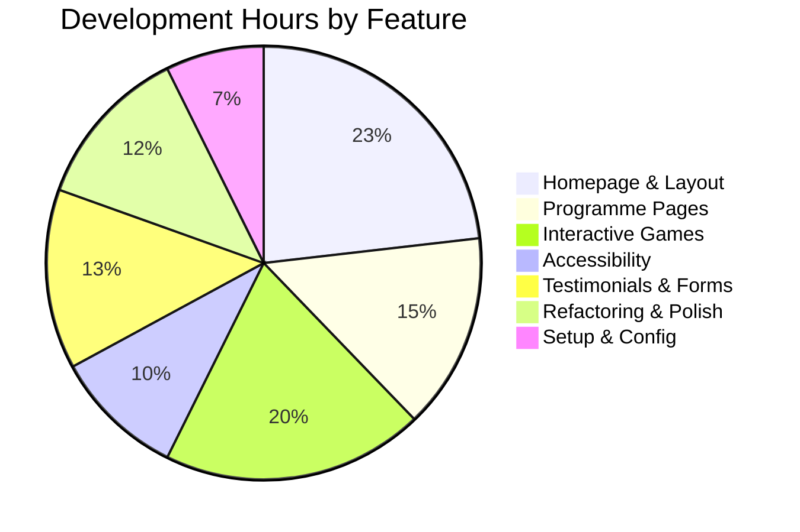

# Time & Effort Estimate

## Project Timeline

**Start Date:** November 26, 2025
**Latest Commit:** December 12, 2025
**Duration:** 17 calendar days

---

## Commit Analysis

| Date | Commits | Key Work |
|------|---------|----------|
| Nov 26 | 4 | Initial project setup, TypeScript config |
| Nov 28 | 1 | **Major:** Complete homepage redesign (5,789 lines) |
| Nov 29 | 2 | Progress page, minor fixes |
| Dec 1 | 2 | Enquire/Vision pages enhancement |
| Dec 2 | 7 | **Major:** Games, testimonials, accessibility overhaul |
| Dec 3 | 4 | Booking system exploration, code cleanup |
| Dec 4 | 1 | Image fixes |
| Dec 11 | 2 | **Major:** Programme pages revamp |
| Dec 12 | 1 | Carousel enhancements |

**Total Commits:** 24

---

## Code Statistics

```
Total Lines of Code:     ~9,700
TypeScript/TSX Files:    37
CSS Files:               1 (globals.css)
Content Files:           2 (siteContent.ts, sessionData.ts)
```

### Lines Changed by Category

| Category | Insertions | Deletions |
|----------|------------|-----------|
| Initial Setup | 16,089 | 3 |
| Homepage Redesign | 5,789 | 207 |
| Interactive Games | 2,502 | 109 |
| Programme Pages | 713 | 100 |
| Enquiry/Vision | 709 | 139 |
| Carousel/Images | 129 | 60 |
| Testimonials System | 226 | 14 |
| Accessibility Updates | 54 | 34 |
| Refactoring/Cleanup | 90 | 4,232 |

---

## Estimated Development Hours

Based on commit complexity, lines changed, and feature scope:

### Phase 1: Foundation (Nov 26-28)
| Task | Hours |
|------|-------|
| Project setup & config | 2 |
| TypeScript configuration | 1 |
| Initial component structure | 4 |
| Homepage design & build | 12 |
| **Subtotal** | **19 hours** |

### Phase 2: Core Pages (Nov 29 - Dec 1)
| Task | Hours |
|------|-------|
| Progress page | 2 |
| Our Vision page | 4 |
| Enquire Now page | 4 |
| Contact form | 3 |
| **Subtotal** | **13 hours** |

### Phase 3: Features & Polish (Dec 2)
| Task | Hours |
|------|-------|
| Header improvements | 3 |
| Testimonials with modal | 4 |
| Accessibility overhaul | 4 |
| Interactive games (4 games) | 16 |
| **Subtotal** | **27 hours** |

### Phase 4: Content & Refinement (Dec 3-12)
| Task | Hours |
|------|-------|
| Session booking exploration | 4 |
| Code refactoring | 3 |
| Programme pages revamp | 8 |
| Carousel system | 4 |
| Final polish & testing | 4 |
| **Subtotal** | **23 hours** |

---

## Total Estimated Hours

| Phase | Hours |
|-------|-------|
| Foundation | 19 |
| Core Pages | 13 |
| Features & Polish | 27 |
| Content & Refinement | 23 |
| **Grand Total** | **82 hours** |

!!! note "Estimation Methodology"
    These estimates are based on:

    - Lines of code changed per commit
    - Feature complexity analysis
    - Standard development velocity for Next.js/TypeScript
    - Component count and reusability
    - Testing and debugging time (included)

---

## Effort Breakdown by Feature



| Feature Area | Estimated Hours | % of Total |
|-------------|-----------------|------------|
| Homepage & Layout | 19 | 23% |
| Interactive Games | 16 | 20% |
| Programme Pages | 12 | 15% |
| Testimonials & Forms | 11 | 13% |
| Refactoring & Polish | 10 | 12% |
| Accessibility | 8 | 10% |
| Setup & Config | 6 | 7% |

---

## Value Delivered

At an average developer rate of £75/hour:

| Metric | Value |
|--------|-------|
| Estimated Hours | 82 |
| Estimated Value | **£6,150** |

This represents the cost of building the site from scratch with the same quality, accessibility standards, and feature set.
